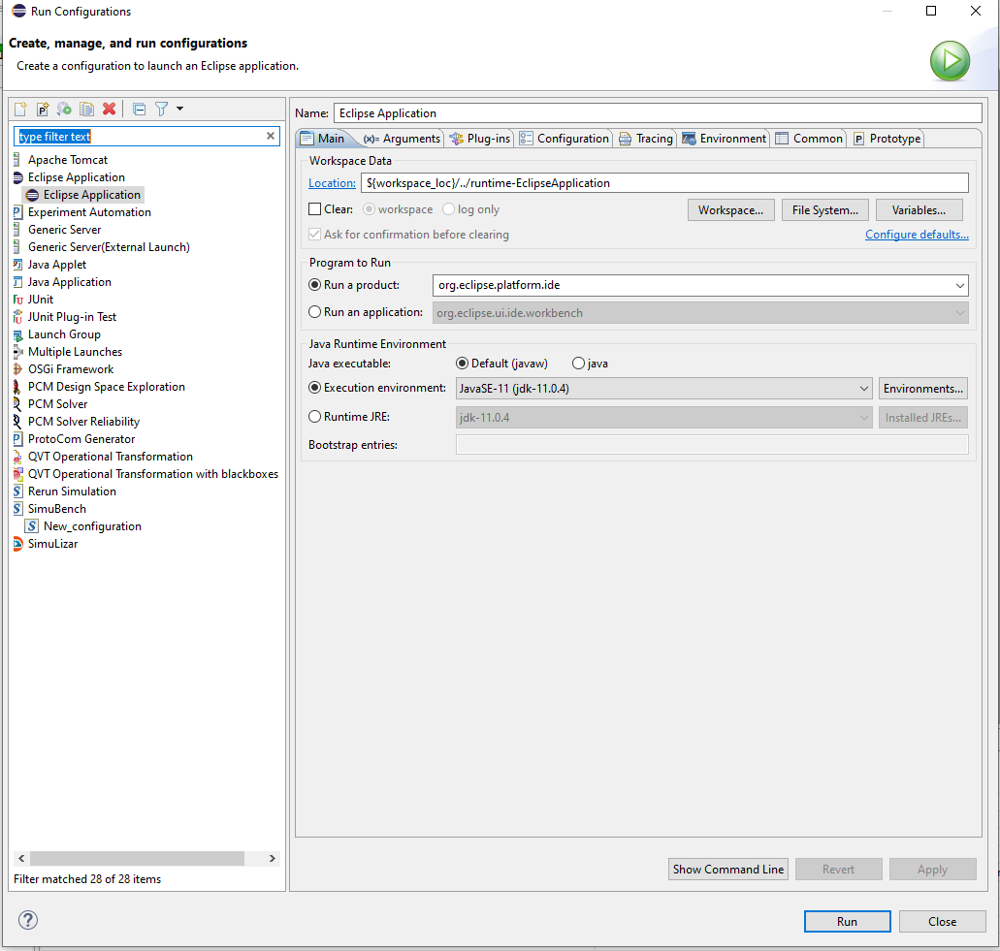
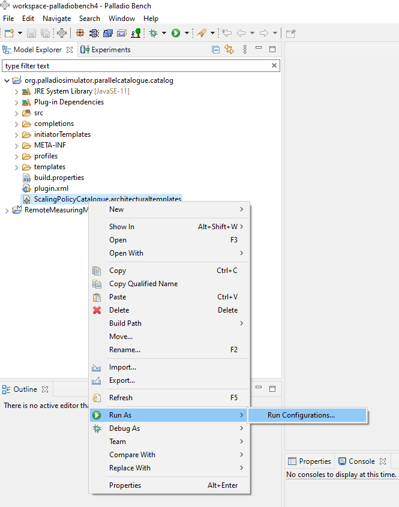
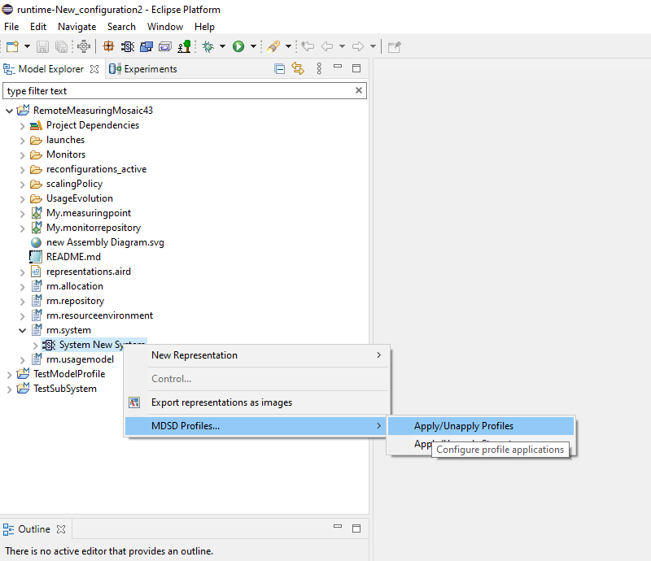
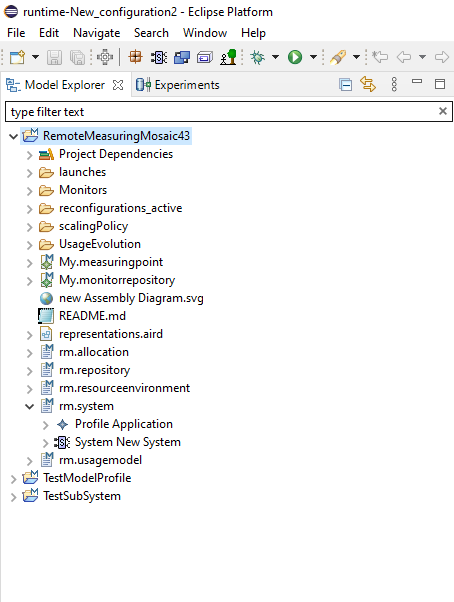

# Profile Tutorial

This tutorial explains the use of an EMF/MDSD Profiles in a PCM project.

## Use
Using the scalingpolicyprofile works as follows. 

Right click on ScalingPolicyCatalogue.architecturaltemplates and run as -> run configurations



Then Eclipse Application and create a new one. Change Program to Run / Run a product to "org.eclipse.platform.ide"



After that you can work with the Profile. 




The easiest way to apply is: 
- 1. Open the system model
- 2. Right click on it
- 3. MDSD Profiles
- 4. First select Apply/Unapply Profiles -> ScalingPolicyProfile -> add
- 5. Second select Apply/Unapply the Stereotype -> ScalingPolicySystem -> add
- 6. Refresh the project with F5
    
It should look like this. 



Be aware of the fact that the profile application is unstable. It often does not work correctly. 
For instance, if the profile is still applied after opening the workspace, it will not work. You need to open it without one applied. If not, the script will fail at the check hasProfileApplied. 
   ```
    [pool-4-thread-167] WARN : Rule application failed with message: The system has no ScalingPolicyProfile applied! 
   ```

### Trouble Shooting
If an error is thrown during the execution of the QVTo self-adaption, then a restart of eclipse is needed. 
Often when getTaggedValue is printed out as invalid - that is an indication to try a restart.
Also, we were not able to use Integer fields respectively to use setTaggedValue (there was a warning that the call is ambiguous), which might be fixed in future versions. 

So it is important to debug. Also, if Palladio version conflicts appear, in our case, a model created with the nightly version did not work in 4.3, even after replacing the representation.aird

To test the profile, see TestModelProfile and NodeUtilization scaler. By executing it, you can test and debug.

## Developing 
For developping we refer to the sdq wiki. [MDSD](https://sdqweb.ipd.kit.edu/wiki/MDSDProfiles), [EMF](https://sdqweb.ipd.kit.edu/wiki/EMF_Profile_Definition) and [AT](https://sdqweb.ipd.kit.edu/wiki/Architectural_Templates) guides. The latter describes how to create an EMF profile in the first part and in the second the AT. Also follow the AT guide instructions to create the _.architecturaltemplates_ . 


Be careful that all IDs are correct, watch the console of the outer Eclipse.


